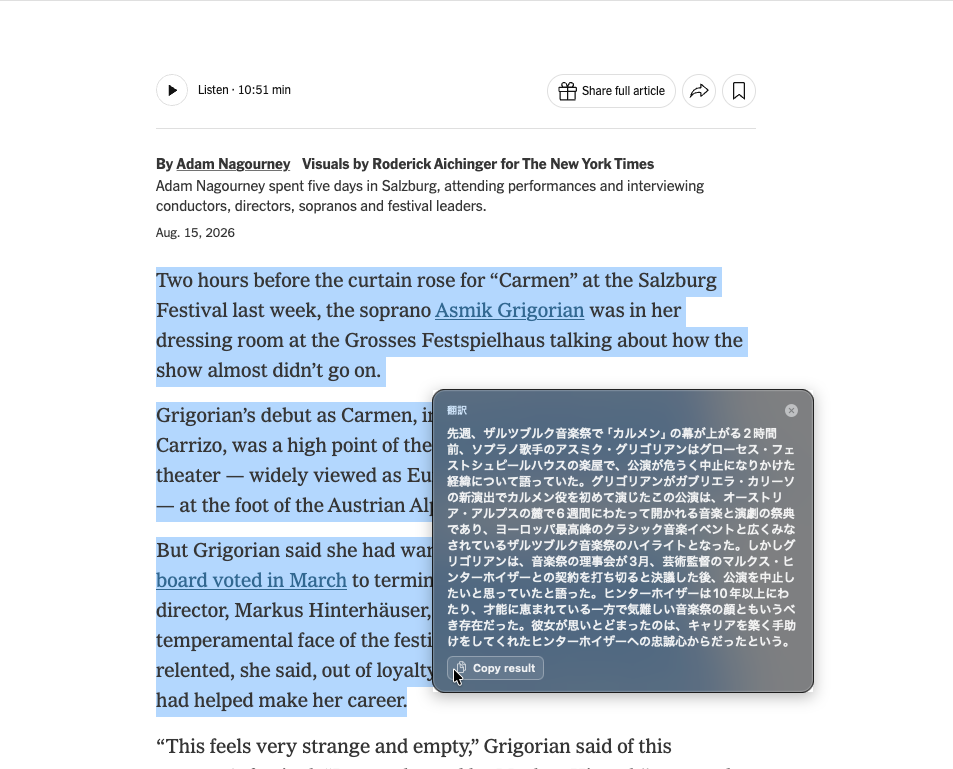
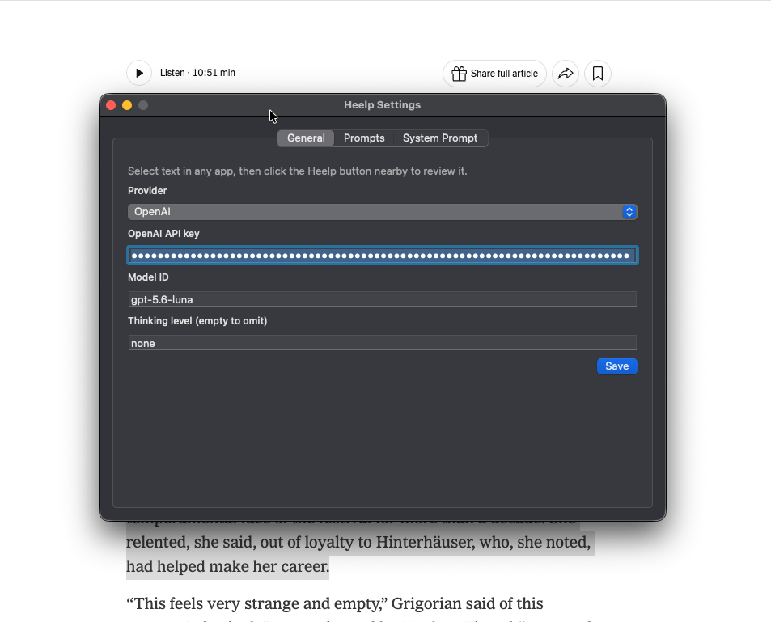
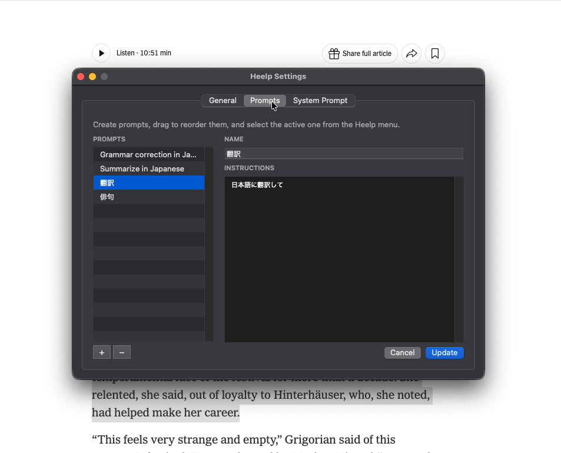

# ppp

ppp is a macOS menu bar app that lets you run any LLM-powered prompt—translation, summarization, rewriting, and more—on selected text and see the result instantly in a nearby popup.

## Features

- Review, translate, or summarize selected text
- Create, edit, reorder, and switch between custom prompts
- Use Anthropic, OpenAI, or OpenRouter with configurable models and thinking levels

## Screenshots

  
  

  
  

